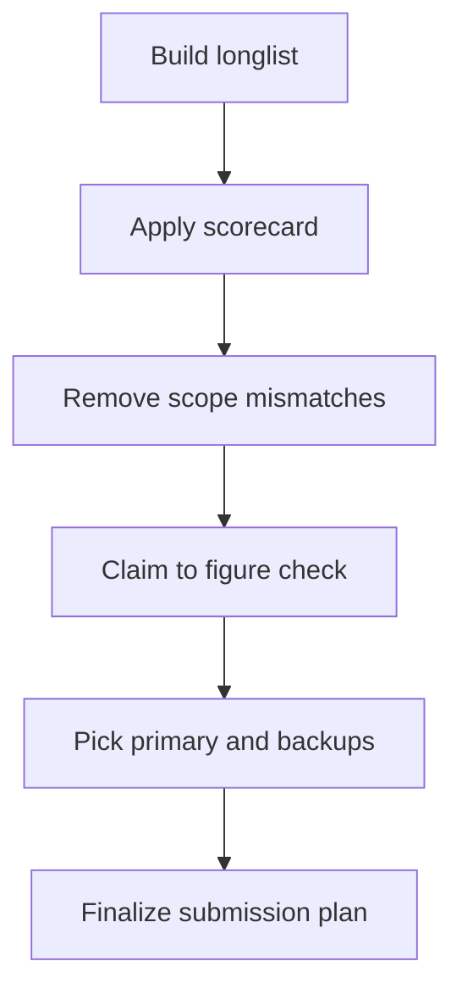

# Journal Shortlist Workflow Diagram

```mermaid
flowchart TD
  A[Build longlist] --> B[Apply scorecard]
  B --> C[Remove scope mismatches]
  C --> D[Claim to figure check]
  D --> E[Pick primary and backups]
  E --> F[Finalize submission plan]
```
